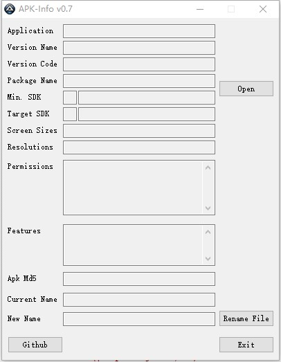

# APK-Info

## 介绍
APK-Info 为一款在windows下查看 apk 信息的小工具.

## 功能
* 应用信息显示
* 应用 md5 显示
* 支持中文应用名
* 支持最新安卓9.0应用

## 运行相关
仅在windows系统下运行,其他系统不支持.

## 开发语言
au3  [http://www.autoitx.com/](http://www.autoitx.com/ "au3论坛")

## 其它
- 如果你有好的建议或者发现bug，欢迎给我提 **issue**.
- 如果该repo对大家有帮助，给个star鼓励鼓励吧.

## 界面展示

    

